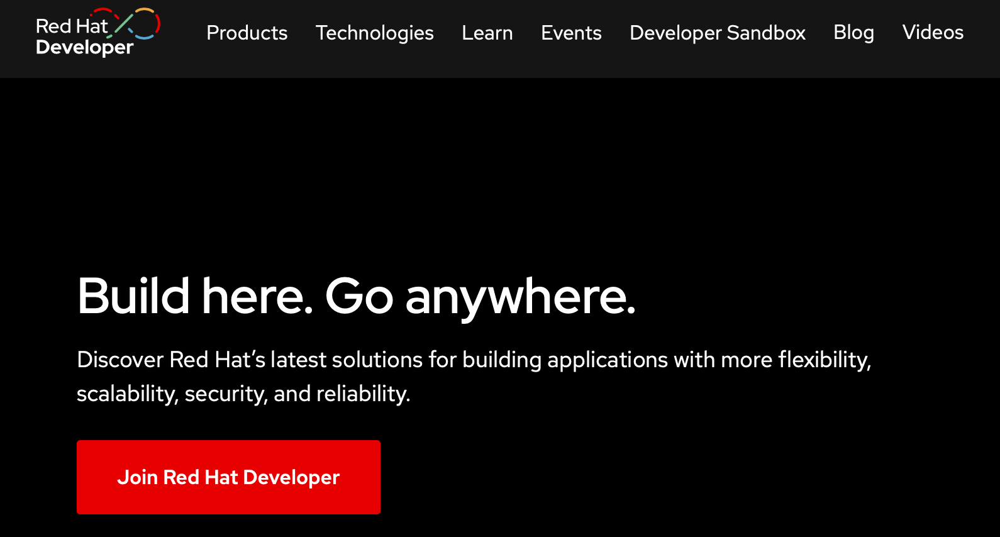
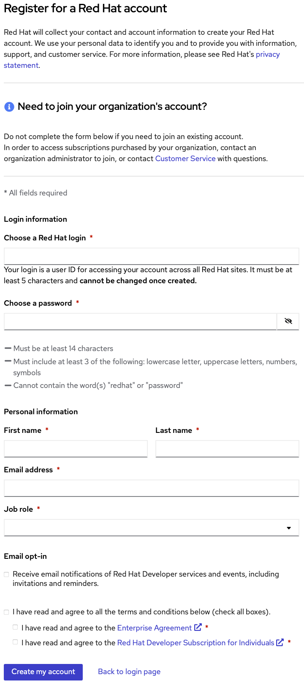
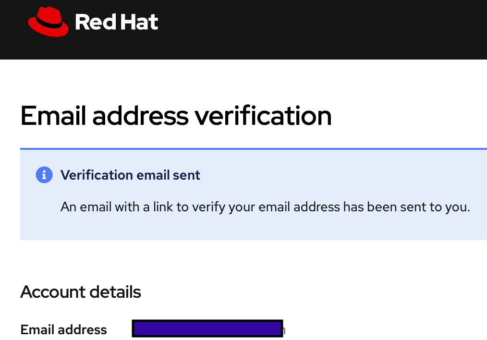
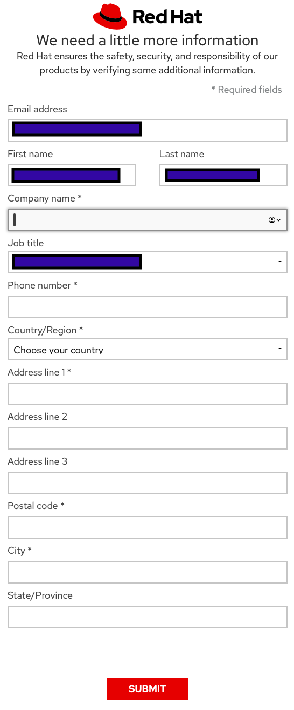
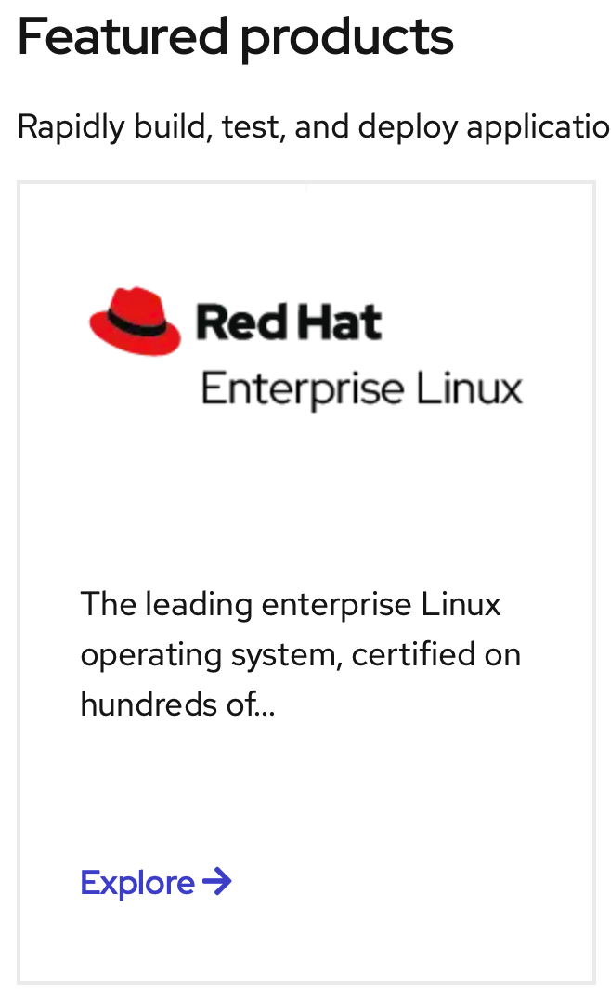
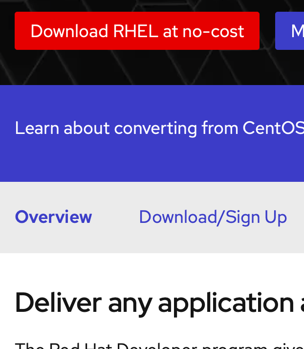
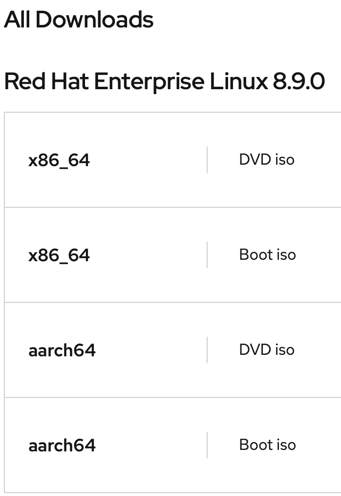

# _Crear una cuenta en Red Hat Developer_
### El programa Red Hat® Enterprise Linux® Developer Program ofrece herramientas del desarrollador líderes del sector, recursos formativos y un ecosistema de expertos que ayudarán a los programadores de Linux a maximizar la productividad a la hora de crear extraordinarias aplicaciones de Linux.

|  | Descripción |
|-----:|---------------|
|  | ***Red Hat Developer*** |

### Capture la información requerida para crear su cuenta como developer

### Verificación de la dirección de correo electrónico

### Descargar el SO
#### Capture la información requerida para descargar el SO

### Ir a la pag principal de Developers en la sección de Featured products - ***Red Hat Enterprise Linux*** -  dar click en Explore

|  | Descripción |
|-----:|---------------|
|  | ***Red Hat Developer*** |

### Dar click en Download/Sign Up

### Ir a la sección de All Downloads - Red Hat Enterprise Linux 8.9.0 y descargar el iSO

# _Instalación de RHEL 8 en VirtualBox_

### **Se necesita un sistema que cumpla con los siguientes requisitos:**
### - _Una máquina x86 de 64 bits con asistencia de virtualización de hardware (Intel VT-X o AMD-V)._
### - _Al menos 4 GB de RAM._
### - _Al menos 28 GB de espacio disponible en disco para la máquina virtual y el archivo .iso._
### - _Tener VirtualBox instalado._

#### ***Notas:***
#### - ***Es posible que deba habilitar la virtualización de hardware en la configuración de BIOS/UEFI de su sistema.***
#### - ***En Windows puede ser necesario desactivar Hyper-V para evitar conflictos con VirtualBox.***

# Crear la máquina virtual

### En VirtualBox, crea una nueva máquina virtual con los siguientes criterios:

### - 2 GB de RAM como mínimo. Se recomienda 4 GB o más.
### - Un disco virtual de 20 GB o más.
### - Se recomiendan 2 o más CPU virtuales.

### Configure la máquina virtual para que arranque desde el archivo RHEL 8 Binary DVD .iso que descargó anteriormente. En la configuración de la máquina virtual, en Almacenamiento, seleccione la unidad óptica debajo del controlador IDE. A continuación, utilice el menú desplegable del icono de CD a la derecha para seleccionar Elegir archivo de disco óptico virtual.

# _Instalación_

## 1. Arranca el instalador de RHEL 8

### Arranque su sistema utilizando el medio de instalación de arranque que contiene el DVD binario RHEL 8 .iso:

#### ***Nota: Durante el arranque, puede omitir el paso de comprobación de medios pulsando la tecla Esc.***
#### ***En las siguientes pantallas, seleccione el idioma y la distribución del teclado preferidos para usar durante la instalación.***

### Ahora debería ver la pantalla principal para configurar su instalación:

# 2. Seleccione el software que se va a instalar

### Haga clic en Selección de software en SOFTWARE. Le recomendamos que:
### - Elija Estación de trabajo a la izquierda en Entorno base
### - A continuación, elija Gestión de contenedores, Herramientas de desarrollo y Herramientas de administración gráfica.

#### ***Nota: No elija Servidor con una interfaz gráfica de usuario como entorno base. Hay un problema conocido que impedirá que el escritorio gráfico se inicie***

# 3. Elija discos/particiones para la instalación
### Haga clic en Destino de instalación en SISTEMA. Elija los discos/particiones que desea utilizar para instalar RHEL.

#### ***Nota: si su sistema solo tiene un disco y está utilizando el disco completo para la instalación, simplemente haga clic en Listo.***

# 4. Desactiva kdump para ahorrar memoria.

### A continuación, para guardar memoria, desactiva kdump haciendo clic en Kdump en SISTEMA. A continuación, desmarque Habilitar Kdump.

# 5. Configurar y habilitar la conexión de red
### A continuación, configure la red y, opcionalmente, establezca el nombre del host. Haga clic en Nombre de red y host en SISTEMA. Entonces:
### - Seleccione su adaptador de red de la lista. Si necesita cambiar cualquier configuración de red, haga clic en Configurar... .
### - Encienda el adaptador haciendo clic en el interruptor a la derecha del botón OFF en la esquina superior derecha. NOTA: Si no habilita el adaptador de red aquí, no tendrá conectividad de red cuando inicie el sistema.
### - Opcionalmente, puede establecer el nombre de host del sistema en la parte inferior izquierda.

# 6. Comienza la instalación
### Cuando esté satisfecho con su configuración, haga clic en Iniciar instalación.

# 7. Crea tu ID de usuario y establece la contraseña de root,
### Mientras continúa la instalación, haga clic en Contraseña de raíz para establecer la contraseña de raíz (Administrador).
### A continuación, cree el ID de usuario normal que utilizará para iniciar sesión en el sistema haciendo clic en Creación de usuario.
### ***IMPORTANTE: Seleccione Hacer que este usuario sea administrador. Esto habilitará sudo para su ID de usuario.***

# 8. Reiniciar y expulsar los medios de instalación
### Cuando se complete la instalación, haga clic en Reiniciar en la esquina inferior derecha.
### ***IMPORTANTE: Mientras su sistema se está reiniciando, no olvide expulsar el medio de instalación para no reiniciar inadvertidamente el instalador de RHEL 8 de nuevo.*** 
### Si tiene una máquina (o máquina virtual) que se reinicia demasiado rápido para expulsar el medio de instalación, puede intentar:
### - Cambiar el orden de arranque en el BIOS
### - Apaga el sistema y luego reinicia el sistema. Expulse el medio durante el POST, o utilice la tecla adecuada para su BIOS (como F12, F10, Enter) para seleccionar un dispositivo de arranque.
### - En VirtualBox, seleccione Dispositivos en el menú de la ventana de la máquina virtual y, a continuación, seleccione Unidades ópticas -> Eliminar disco de la unidad virtual para expulsar la ISO de instalación. Si el sistema ya se ha arrancado en el instalador, tendrá que hacer clic en Forzar desmontar. A continuación, restablezca la máquina virtual, ya sea a través del menú Máquina o utilizando el método abreviado de teclado Derecho CTRL + R (Windows/Linux) o Comando izquierdo + R (Mac). La máquina virtual debería arrancar desde el disco duro virtual.

# Registro del sistema
### Primer arranque
### Cuando el sistema se reinicie, haga clic en Información de la licencia para aceptar el acuerdo de licencia. En la pantalla Información de la licencia, haga clic en Acepto el acuerdo de licencia debajo del texto de la licencia.

# Instalacion Completa

# Registro del sistema desde la línea de comandos
### Puede registrarse en cualquier momento utilizando la línea de comandos. Inicia una Terminal haciendo clic en Actividades. Seleccione el icono de la terminal en la parte inferior izquierda.

## ***En la ventana de la terminal, inicia sesion como root:***

- $ su -

## ***A continuación, registre su sistema con Red Hat Subscription Management:***

- #subscription-manager register --auto-attach

## ***Introduzca su nombre de usuario y contraseña de Red Hat. Cuando se haya completado el registro, verás:***
- Installed Product Current Status:
- Product Name: Red Hat Enterprise Linux for x86_64
- Status:       Subscribed

## ***Comprueba que ahora tienes los repositorios de BaseOS y AppStream habilitados con yum repolist***

- #yum repolist
- Updating Subscription Management repositories.
- Red Hat Enterprise Linux 8 for x86_64 - AppStream (RPMs)
- Red Hat Enterprise Linux 8 for x86_64 - BaseOS (RPMs)

## Puedes seguir y apoyar mi trabajo haciendo click en "☆ Star" y en el botón de Follow.
## ¡Muchas gracias, bienvenido!!!

## Contacto y apoyo:

 
 

