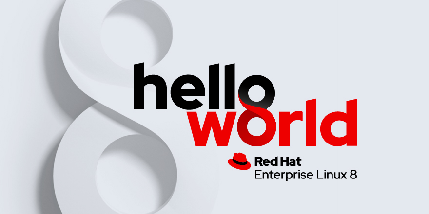

# - _**Configuración inicial de Red Hat 8**_

## **El propósito de este repositorio es enseñar a colaboradores, colegas y estudiantes, sobre la configuración inicial, del sistema operativo mas utilizado por las empresas**

# ¿Por qué elegir Red Hat para Linux?
## Descripción general
### Todas las tecnologías de su pila de TI deben funcionar en conjunto. Y las cargas de trabajo deben ser portátiles y escalables a través de servidores básicos, máquinas virtuales, contenedores y nubes públicas y privadas. Necesitan un sistema operativo (SO) moderno y orientado a la seguridad. Ese sistema operativo es Red Hat® Enterprise Linux®.

### Red Hat es un socio de confianza para más del 90% de las empresas de Fortune 500, incluida Salesforce, que está  migrando su infraestructura completa de CentOS Linux a Red Hat Enterprise Linux . Red Hat Enterprise Linux es su base para la innovación y ofrece las últimas herramientas de desarrollo estable, tecnologías de contenedores, hardware y avances en la nube. Una suscripción a Red Hat Enterprise Linux le proporciona acceso directo y promoción dentro de la comunidad de código abierto. También se integra con miles de proveedores certificados de nube, software y hardware.

# Red Hat y código abierto
### Red Hat es uno de los principales contribuyentes al kernel de Linux y las tecnologías asociadas en la gran comunidad de código abierto , y lo ha sido desde el principio. Esto difiere mucho de los sistemas operativos tradicionales (Unix, Microsoft Windows y MacOS), que son propietarios y mucho menos modificables. Los ingenieros de Red Hat ayudan a mejorar las funciones, la confiabilidad y la seguridad para garantizar que su infraestructura funcione y permanezca estable, sin importar su caso de uso y carga de trabajo.

### Red Hat también utiliza productos de Red Hat internamente para lograr una innovación más rápida y un entorno operativo más ágil y receptivo.

### Con Red Hat, obtiene acceso a los beneficios del código abierto para la empresa, como la innovación ascendente impulsada por la comunidad, brindada con soporte a nivel empresarial para ayudar a su organización a utilizar de forma segura la tecnología de código abierto.

### [Red Hat Docs](https://www-redhat-com.translate.goog/en/topics/linux/why-choose-red-hat-enterprise-linux?_x_tr_sl=en&_x_tr_tl=es&_x_tr_hl=es&_x_tr_pto=rq#:~:text=With%20Red%20Hat%2C%20you%20get,safely%20use%20open%20source%20technology.)
### [RH8 Config](./ConfRH8/ConfIni_RH8.md)

## Puedes seguir y apoyar mi trabajo haciendo click en "☆ Star" y en el botón de follow.
# ¡Muchas gracias, bienvenido!!!

## Contacto y apoyo:

 
  